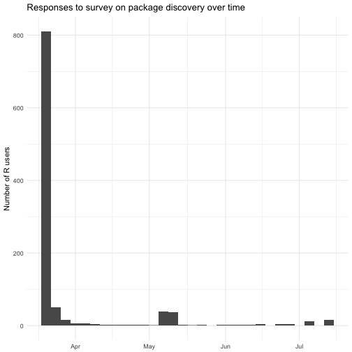

---
output:
  md_document:
    variant: markdown_github
---

<!-- README.md is generated from README.Rmd. Please edit that file -->


# packagesurvey: An online survey of R users about navigating the R package universe

**Author:** [Julia Silge](http://juliasilge.com/) <br/>
**License:** [MIT](https://opensource.org/licenses/MIT)


There are now more than 11,000 packages on CRAN, and R users must approach this abundance of packages with effective strategies to find what they need and choose which packages to invest time in learning how to use. At useR!2017, I contributed to an [organized session](http://sched.co/AypJ) focused on discovering, learning about, and evaluating R packages. In preparation for that session, I ran a brief online survey in the spring of 2017 to ask R users how they currently discover and learn about R packages. This package contains the results of that survey.

## Installation

This package can be install from GitHub using devtools.


```r
devtools::install_github("juliasilge/packagesurvey")
```

## Data

The survey results are available in this package in the `package_survey` data object.


```r
library(packagesurvey)
data("package_survey")
```

There were 1039 respondents to the survey. You can easily explore how many respondents chose each answer.


```r
library(dplyr)

package_survey %>%
    mutate(total = n_distinct(respondent)) %>%
    count(answer, total) %>%
    arrange(desc(n)) %>%
    mutate(proportion = scales::percent(n / total)) %>% 
    select(-total, -n) %>%
    kable(col.names = c("How do you currently discover and learn about R packages",
                        "% of respondents who chose each answer"))
```


|How do you currently discover and learn about R packages                                                        |% of respondents who chose each answer |
|:---------------------------------------------------------------------------------------------------------------|:--------------------------------------|
|Social media such as blogs, R-bloggers, Twitter, Slack, or GitHub contacts                                      |79.8%                                  |
|General search websites such as Google and Yahoo                                                                |57.0%                                  |
|Your personal network, such as colleagues and professors                                                        |41.6%                                  |
|Books, textbooks, or journal articles (JSS, JOSS, R-Journal)                                                    |31.9%                                  |
|Conferences, meet-ups, or seminars                                                                              |24.1%                                  |
|CRAN Task Views                                                                                                 |21.8%                                  |
|Email lists such as r-help, r-packages, or r-pkg-devel                                                          |15.3%                                  |
|R-specific search websites such as METACRAN (www.r-pkg.org) or Rdocumentation (https://www.rdocumentation.org/) |11.1%                                  |
|Other (send ideas to @juliasilge on Twitter!)                                                                   |4.2%                                   |
|R packages built for search such as the sos package                                                             |2.2%                                   |

You might also be interested in when R users responded to the survey.


```r
package_survey %>%
    ggplot(aes(response_time)) +
    geom_histogram() +
    labs(x = NULL,
         y = "Number of R users",
         title = "Responses to survey on package discovery over time")
```




This project is released with a [Contributor Code of Conduct](CONDUCT.md). By participating in this project you agree to abide by its terms.


